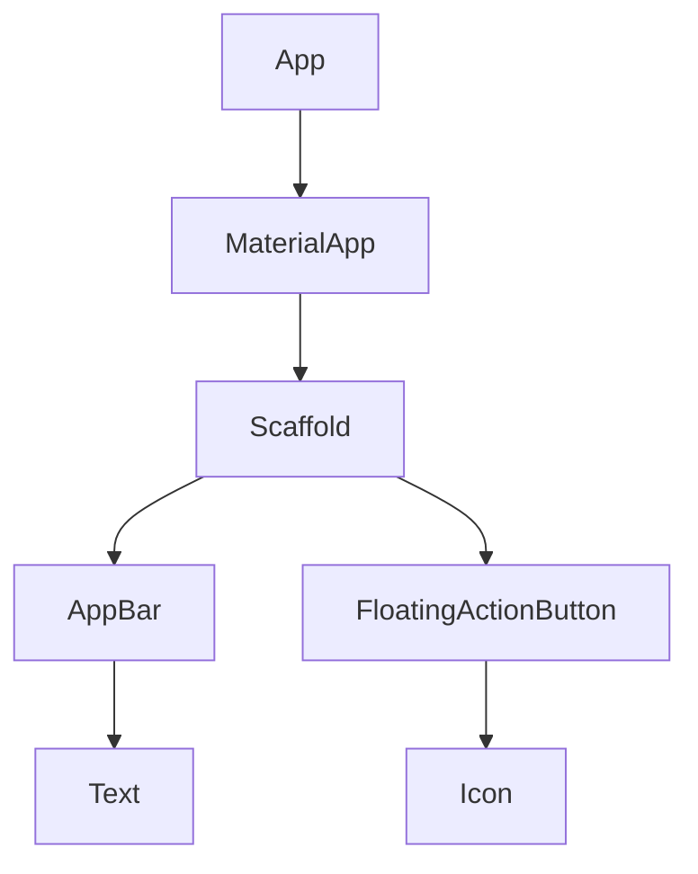

# Introductions

## How to we make Flutter apps?

- We build widgets that control UI elements on the screen
- We mix and match widgets to build the desired UI for the app we're making
- Some widgets are provided by Flutter
- Some are created by you

### [Scaffold](https://api.flutter.dev/flutter/material/Scaffold-class.html)

> **_scaffold_**: a structure made of scaffolding for workers to stand on when they want to reach high parts of a building

- general layout widgets
- you add other widgets to it

## The Four Step Design Process

```dart
// I need to import a helper library
// from flutter to get content on the screen
import 'package:flutter/material.dart';

// Define a 'main' function to run when our app starts
void main() {
// Create a new text widget to show some text
// on the screen
  var app = MaterialApp( // create widget
    home: Text('Hi there!') // first screen after boot
  );
// Take that widget and get it on the screen
}

```

### Step 1. Import Helper Library

```dart
import 'package:flutter/material.dart';
```

- `import`: import code from somewhere else
- `package:`: importing code from a third party package, not a dart std lib
- `flutter`: the name of the package
- `/material.dart`: the file importing from that package

### Step 2. Add Widgets in the `main` function

> the code below won't work with hot reload

```dart
void main() {
  var app = MaterialApp( // create widget
    home: Text('Hi there!') // first screen after boot
  );
}
```

#### hot reload working version

```dart
void main() => runApp(MyApp());

class MyApp extends StatelessWidget {
  @override
  Widget build(BuildContext context) {
    return MaterialApp(
      home: Scaffold(
        appBar: AppBar(title: Text('Hot reload works!')),
      ),
    );
  }
}
```

---

## Widget

### StatelessWidget

> used if this widget will never contain its own data

### StatefulWidget

> used if this widget is going to maintain some data source

### AppBar example

[link: `PreferredSizeWidget` error when adding class to the appBar](https://stackoverflow.com/questions/52678469/the-appbardesign-cant-be-assigned-to-the-parameter-type-preferredsizewidget)

```dart
import 'package:flutter/material.dart';
// `with` can replace `implements`
class MyAppBar extends StatelessWidget implements PreferredSizeWidget {
  const MyAppBar({super.key});
  // required by PreferredSizeWidget
  @override
  Size get preferredSize {
    return const Size.fromHeight(50.0);
  }

  @override
  Widget build(BuildContext context) {
    return AppBar(
      title: const Text('Hot reload works!!'),
      backgroundColor: Colors.blueGrey[900],
    );
  }
}
```

or just wrap into `PreferredSize`

```dart
return Scaffold(
  appBar: PreferredSize(
    preferredSize: const Size.fromHeight(100),
    child: Container(color: Colors.red),
  ),
)
```

### Structure


